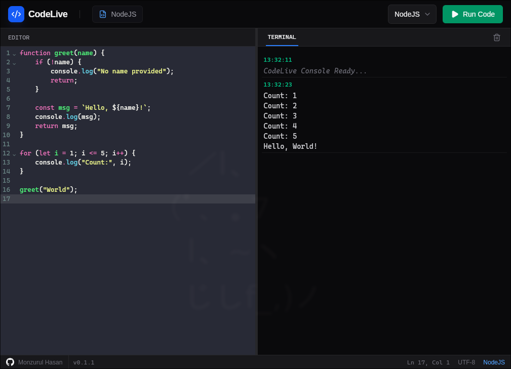
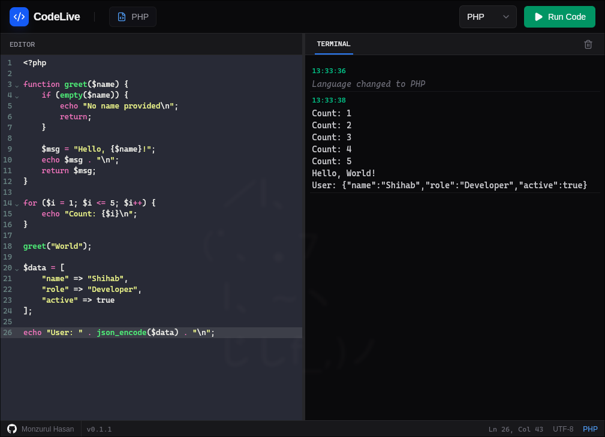
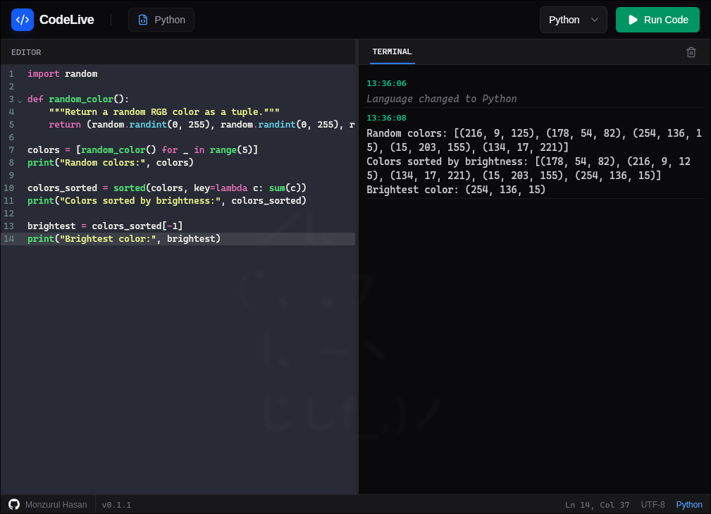

<p align="center">
  
</p>

# CodeLive

A lightweight code runner built with [**Tauri**](https://tauri.app/) and [**Vite**](https://vite.dev/) with [**React**](https://react.dev/). It acts as a simple wrapper around the language binaries already installed on your system, using them directly to execute code.

---

## Screenshots

| NodeJS | PHP | Python |
|--------|-----|--------|
|  |  |  |


---

## Download

Get the latest release:  
[https://github.com/mhs003/codelive/releases](https://github.com/mhs003/codelive/releases)

Or build from source:

### Prerequisites

- [See other prerequisites in Tauri docs](https://tauri.app/start/prerequisites/)

### Install nodejs dependencies

```bash
npm install
````

### Run the App with Tauri (Dev)

```bash
npm run tauri dev       # you don't need to start react dev server, this will start both react and tauri
```

### Build Production Bundle

```bash
npm run tauri build   # produce native build and installers
```

## License

CodeLive is released under the [MIT License](https://opensource.org/licenses/MIT).
